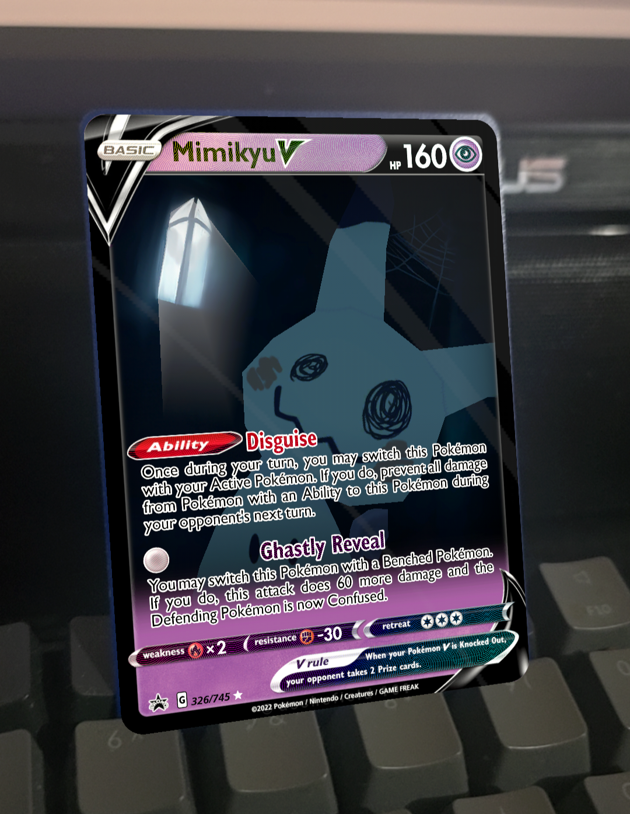

# Holographic AR Card 

For this project, I decided to create a Pokemon card visualiser in AR. I sought to replicated some of the visible characteristics of the cards such as the holographic effects seen in some of the cards as well as a stencil effect seen in some AR applications and games. 

# Demo Download

[Android APK](https://github.com/Rbocarro/Holgraphic_AR/releases)

# Tools and Techniques Used

## AR Foundation
AR foundation was used as it provided a straightforward framework for implementing image Tracking. It was important to set the image tracking pysical size to the real world scale of a standard Pokemon TCG (63.5mm x88mm) and your gameobject to x0.01 times scale(intuitively im not sure why it does not follow the 1meter=1 unit scale)

## Stencil Shader
 
I used a stencil-buffer window on the card to reveal the 3D model and background elements only when viewed through the cutout.This is achived by having a dedicated stencil material that writes a reference value and the model renders only when the stencil ref value matches. In URP, the RenderObjects feature handles the stencil override for both opaque or transparent materials that are on Cardwindow layer.

## Holographic Shader
 
I used Unity’s Shader Graph to create the Holographic effect.It is primarily based off RMT's shader which uses the view direction in tangent space to offset a hue vaule by a set amount and can then by multiplied by a holofoil pattern image to achive a convincing holofoil effect. this was convertered into a subshader graph for easy reusability in the main card shader.

##Stylised Specular
 
Specular reflections were faked using a premade texture that was offset based off the view angle.

## Card Overlay
Card Overlay's visual elements were created using [Pokecardmaker](https://pokecardmaker.net/) .

## References
+ [Mimikyu Model by AlmondFeather](https://sketchfab.com/3d-models/mimikyu-ad2aaa7bb372441984f40df49854b3eb) - [Twitter](https://x.com/AlmondFeather)
+ [Daniel-ilett - Holographic Foil Cards with Shader Graph in Unity URP](https://github.com/daniel-ilett/shaders-holo-card)
+ [cyanilux - Holofoil Card Shader Breakdown](https://www.cyanilux.com/tutorials/holofoil-card-shader-breakdown/)
+ [Rigor Mortis Tortoise - Holographic Card Tutorial](https://www.youtube.com/watch?v=rYsWYjHzaMY)
+ [ameye.dev - Holographic Card Shader](https://ameye.dev/notes/holographic-card-shader/)

